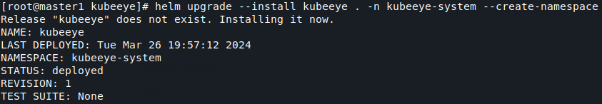
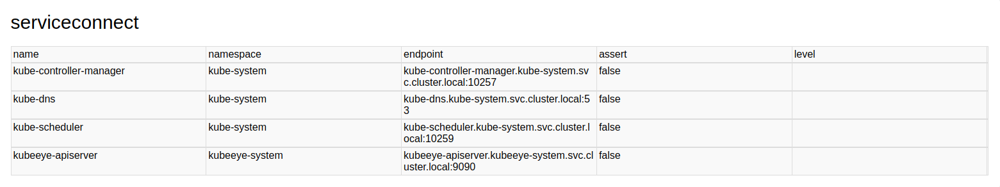

<div align=center></div>

<p align=center>
<a href="https://github.com/kubesphere/kubeeye/actions?query=event%3Apush+branch%3Amain+workflow%3ACI+"></a>
<!-- ALL-CONTRIBUTORS-BADGE:START - Do not remove or modify this section -->
<a href="https://github.com/kubesphere/kubeeye#contributors-"></a>
<!-- ALL-CONTRIBUTORS-BADGE:END -->
</p>

> [English](README_en.md)| [中文](README.md)

KubeEye 是为 Kubernetes 设计的云原生集群巡检工具，用于根据自定义规则发现 Kubernetes 集群中存在的问题及风险。

## 快速开始

### 安装
本项目[chart目录](chart/)（其中包含helm chart，以及供离线环境部署的镜像）

本项目[deploy目录](deploy/)（其中包含rule、plan、ssh配置ComfigMap，**ssh配置需根据实际情况修改**）

```shell
git clone https://gitlab.kylincloudnative.com/longyuxiang/kubeeye.git
# 如需离线安装，请自行将images中的镜像导入本地仓库，并修改 chart/kubeeye/values.yaml 中的镜像地址。

helm upgrade --install kubeeye chart/kubeeye -n kubeeye-system --create-namespace
```

### 使用
  
> deplot/rule目录下提供了demo规则，可根据需求自定义规则。

> 注意 prometheus 规则需提前为规则设置[prometheus的endpoint](deploy/rule/kubeeye_v1alpha2_prometheusrule.yaml)。

> 注意 outOfCluster 规则需提前创建[ssh-configmap.yaml](deploy/ssh-configmap.yaml),根据实际情况修改。

```
cd deploy
kubectl apply ssh-configmap.yaml
```

#### 创建规则（请检查kubeeye_v1alpha2_outofcluster.yaml配置中的hosts、nodeSelects在上一步中的配置中有定义）
```shell
cd deploy
kubectl apply -f rule
```

#### 创建巡检计划
按需配置巡检计划,计划具体配置见plan/plan.yaml注释
```shell
cd deploy
kubectl apply -f plan/plan.yaml
```

#### 巡检报告获取
##### 查询巡检结果
###### 命令行方式查询
```shell
# 查看巡检结果名称，用于后续巡检报告下载
kubectl get inspectresult
```
###### 浏览器查询 [New] [点击查看示例](examples/result/Inspect Results.html)
```shell
## 为 kubeeye-apiserver 创建 nodePort 类型svc
kubectl -n kubeeye-system expose deploy kubeeye-apiserver --port=9090 --type=NodePort --name=ke-apiserver-node-port

## 浏览器输入巡检报告url查看, 注意替换 <> 为环境中查询到的实际信息
http://<node address>:<node port>/kapis/kubeeye.kubesphere.io/v1alpha2/inspectresults?type=html
```

##### 获取巡检报告
###### 命令行方式下载
```shell
## 获取 kubeeye-apiserver svc地址和端口
kubectl get svc -n kubeeye-system kubeeye-apiserver -o custom-columns=CLUSTER-IP:.spec.clusterIP,PORT:.spec.ports[*].port

## 下载巡检报告, 注意替换 <> 为环境中查询到的实际信息
curl http://<svc-ip>:9090/kapis/kubeeye.kubesphere.io/v1alpha2/inspectresults/<result name>\?type\=html -o inspectReport.html

## 下载后可使用浏览器打开html文件查看
```
###### 浏览器查看 [点击查看示例](examples/result/inspect report.html)
```shell
## 为 kubeeye-apiserver 创建 nodePort 类型svc
kubectl -n kubeeye-system expose deploy kubeeye-apiserver --port=9090 --type=NodePort --name=ke-apiserver-node-port

## 浏览器输入巡检报告url查看, 注意替换 <> 为环境中查询到的实际信息
http://<node address>:<node port>/kapis/kubeeye.kubesphere.io/v1alpha2/inspectresults/<result name>?type=html
```

## 支持规则清单
* 集群外节点shell巡检规则 [New]
* Shell 规则
* OPA 规则
* PromQL 规则
* 文件变更规则
* 内核参数配置规则
* Systemd 服务状态规则
* 节点基本信息规则
* 文件内容检查规则
* 服务连通性检查规则

### 结果图示
> 说明： 图中assert列为true表示异常，巡检时node2节点处于异常状态
#### 集群外节点shell巡检规则

#### Shell 规则

#### OPA 规则


#### PromQL 规则

#### 文件变更规则

#### 内核参数配置规则

#### Systemd 服务状态规则

#### 节点基本信息规则

#### 文件内容检查规则

#### 服务连通性检查规则

#### 平台基本组件检查（默认开启不可关闭）
